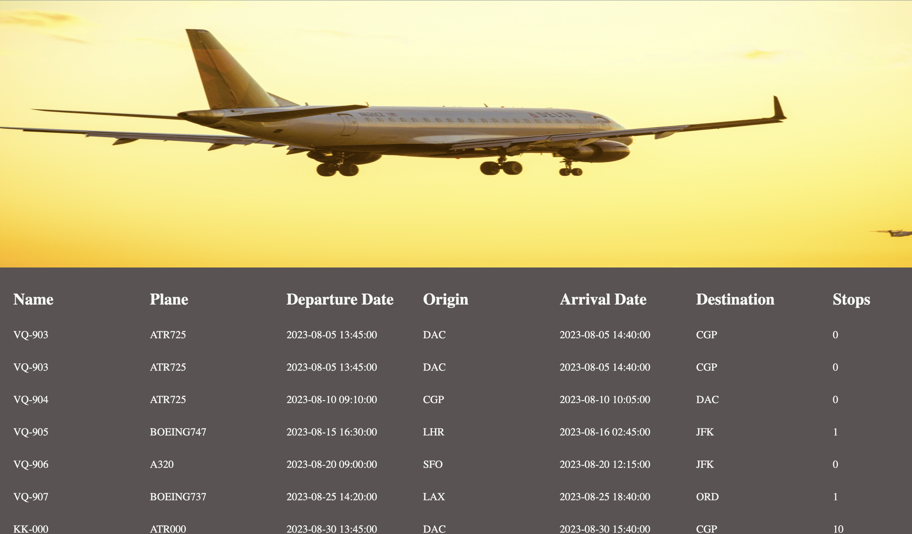

# Image gallery

> A simple

## Table of contents

- [General info](#general-info)
- [Screenshots](#screenshots)
- [Technologies](#technologies)
- [Setup](#setup)
- [Features](#features)
- [Status](#status)
- [Inspiration](#inspiration)
- [Contact](#contact)

## General info

> The objective of the project is to practice separation of concern in
> JavaScript.

## Screenshots

## Technologies

- JavaScript
- HTML5
- CSS3
- VSC code

## Setup

clone the repo and start using the stop watch.

## Code Examples

const dom = {
    parent: document.getElementById('parent'),
};

export default dom;

## Features

List of features ready and Todos for future development

- Hero image
- List of flight details

## Status

Project is: done